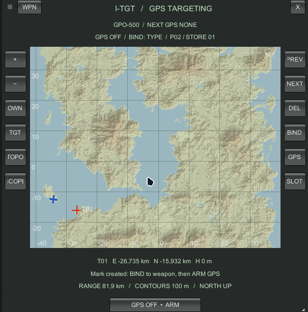

# Phantasm's Arsenal

One DLL containing four editable Blueprinter weapon packs and an **I-TGT GPS targeting system** for **Nuclear Option**.

[Download the DLL](https://github.com/XBarni999/Phantasms-Arsenal/raw/refs/heads/main/dist/Phantasms-Arsenal.dll) · [Weapon gallery](docs/GALLERY.md) · [Editing guide](docs/EDITING.md)

| Pack | Weapons |
| --- | --- |
| Poseidon | R-460 aircraft, nuclear and TEL anti-ship variants |
| Killjoy | HSM-290 conventional and nuclear ballistic missiles |
| Apex | Apex drones, airborne variants and cargo pallets |
| Circuit Breaker | Blackout HPM missile, Locust mine dispensers, Lawn Chair and Zhdan smart mines |

## What each weapon does

### R-460 Poseidon — anti-ship cruise missiles

Use the conventional aircraft missile against ships. It is an air-launched cruise missile with a configured maximum launch range of 200 km; practical reach depends on the launch conditions. The nuclear aircraft variant replaces the conventional warhead with a 1.5-kiloton nuclear warhead for concentrated targets. Both aircraft variants share the same exterior.

The TEL variant is launched from a ground vehicle and uses a detachable booster before cruise flight. Its configured engagement range is 108 km. The TEL runtime keeps its automatic target selection focused on ships. The ground launcher and aircraft variants are separate loadout options.

### HSM-290 Killjoy — heavy ballistic strike

Killjoy is a heavy air-launched aeroballistic missile for long-range surface strikes. It accelerates through its motor stages, coasts along a guided lofted trajectory, then dives steeply onto the target. Launch altitude and aircraft speed affect its reach; there is no fixed minimum release altitude. Choose the conventional version for an explosive strike or the nuclear version for a nuclear strike. It requires a compatible heavy-missile station.

### Apex — expendable attack drones

Apex-6 is a low-altitude jet attack drone with a 38 kg shaped-charge/HE warhead. Apex-8 is the faster air-launched variant with a 68 kg shaped-charge/HE warhead. Select a surface target before launch; these are expendable attack weapons rather than reusable aircraft under player control.

Cargo pallets carry eight Apex-6 or four Apex-8 drones. After a ramp drop, they wait seven seconds for separation, then launch their drones at 0.8-second intervals. Pallets require the corresponding compatible cargo mount; aircraft rails and the TEL use their own mounting operations.

### AGM-180 Blackout — temporarily suppress air defenses

Blackout carries a high-power microwave emitter. In native targeting mode, select an **enemy ground radar or SAM** before firing: targetless launches and ordinary tank targets are rejected. Alternatively, assign an I-TGT GPS mark and arm GPS to launch toward that coordinate. The missile remembers its original target or coordinate even if you change selection after launch.

At the default settings, emission starts within 10 km of that target and lasts 20 seconds, affecting exposed receivers within 10 km of the moving missile. Terrain blocks exposure. It suppresses enemy ground electronics, radar, laser defenses and missile-defense targeting. It is intended to open a temporary attack window, rather than destroy a site with a large explosion; its impact charge is only 2 kg HE.

**Friendly aircraft are affected too.** Aircraft of every faction in the emission zone lose radar contacts and remote datalink access. Local optical observations remain available. Electronics recover four seconds after their last exposure. Radar-guided launches can be restricted during the outage; optical, infrared, laser, inertial and unguided weapons retain their native launch behavior. After emission ends, Blackout attacks its remembered surviving target.

### CBU-82M Locust — contact minefield

Locust is an unguided 400 kg dispenser delivered using CCIP. It deploys conventional 7 kg contact mines onto the ground to threaten vehicles crossing the mined area. Mines last 210 seconds after touchdown by default. Use it to cover roads or vehicle routes. The mines are submunitions; select the dispenser in the aircraft loadout.

### CBU-82S Lawn Chair / Zhdan — sensor ambush

Lawn Chair uses a similar dispenser body but carries eight Zhdan sensor mines. Unlike Locust contact mines, Zhdan waits for an enemy ground vehicle within 70 m and requires clear line of sight. It arms four seconds after landing; terrain, bridges and obstacles can prevent detection or attack.

When a target is available, the mine checks its attack corridor, reserves the target, hops upward and hands off to a vanilla GS25 at an 80 m apex. Each mine gets one shot, and nearby mines coordinate target reservations. Unused mines expire after 300 seconds. Choose Lawn Chair to set a vehicle ambush, and Locust to lay a contact minefield. Zhdan is not a separate aircraft loadout item. Its hop, handoff and multiplayer behavior still require further mission testing.

## I-TGT GPS screen

During flight, press **F6** (default). Change the binding in the game's **Settings → I-TGT GPS SETTINGS** panel: click the binding, then press a new key; Escape cancels. No launcher is displayed while the MFD is closed. The MFD has a light topographic map in a dark bezel, 100 m contours, shaded relief, a north-up grid and an aircraft silhouette with a white nose tip. The terrain layer is generated at 2048×2048 with filtered mipmaps. Terrain sampling and relief shading run gradually after entering a mission; the map displays the generation progress. See the [Ukrainian quick-start guide](docs/ITGT-GUIDE.uk.md).

1. Click the map to create a mark (up to 16). Coordinates are mission east/north positions in kilometres, with terrain elevation in metres; these are not real-world latitude/longitude.
   Alternatively, select a Data Link target and press **DL→GPS** to copy the first selected target's known HQ position into a new mark. This saves a coordinate snapshot, not a moving target link.
2. Select a compatible aircraft weapon using the normal game controls or **WPN**. Choose a mark with **PREV/NEXT**, then choose the assignment scope with **SCOPE**: **TYPE** assigns the weapon type, **PYLON** assigns a pylon, and **STORE** assigns one mounted bomb or missile. **SLOT** cycles the available stores; the display identifies their pylon and store number. Press **BIND** to save the assignment. Different pylons and individual stores can use different marks.
3. Press **ARM** or **GPS**. This also binds the selected mark at the selected scope. Normal releases follow the game's existing store order: an individual store assignment takes priority over its pylon, then its weapon type. The next release's GPS mark is displayed. An unassigned compatible store is held while GPS is armed. Each released weapon retains its coordinate when you change selection later; individual store assignments are consumed at release. GPS uses single-store releases; native object-target salvos resume after disarming.
4. Use the mouse wheel or **+/−** to zoom, right-drag to pan, **OWN/TGT** to recenter, and **DEL** to remove the selected mark. Drag the bezel's header to move the screen or its lower-right corner to resize it. F6 closes it without disarming GPS. Close the screen before firing; native menu and landing-gear weapon safeties still apply.

Mouse-driven camera pan, tilt and zoom are blocked while the cursor is over the MFD (including resize drags). Leaving it restores normal camera input. Flight controls remain available.

Supported guidance: optical guided bombs, optical missiles, INS/optical cruise missiles, ballistic INS missiles, and laser-guided bombs with a coordinate midcourse. Optical terminal acquisition searches near the mark and requires line of sight and seeker field of view. Laser acquisition requires a genuinely illuminated target. If no target is acquired, the coordinate remains the aim point. Blackout activates around the coordinate using its existing HPM flight logic.

The flight HUD marks the selected GPS point with a diamond, distance and bearing, including an edge marker when it is off screen. With GPS armed, it follows the next store's assignment. Small unboxed text above the main flight HUD provides an advisory bomb delivery cue: **TOO FAR / HOLD**, **TURN LEFT/RIGHT**, **CLIMB**, or **RELEASE WINDOW ~**. The estimate uses aircraft altitude/velocity and the native weapon range model; the green window is approximate, without terrain-path or wind prediction. There is no arbitrary minimum-distance rejection. It does not guarantee impact or bypass weapon safeties. Deleting all marks restarts numbering at T01.

GPS-guided weapons with a native submunition dispenser require a real exposed enemy surface unit near the designated point before dispensing. GPS flight alone does not fabricate a target. The GPS adapter uses the native networked dispenser damage/deployment path after observing that unit, allowing the native submunition target selection to continue. Empty coordinates cannot satisfy this target requirement. Locust and Lawn Chair remain unguided CCIP mine dispensers.

The plugin exports a snapshot of loaded weapon definitions and GPS eligibility to `BepInEx/config/Phantasms-Arsenal-GPS-weapons.csv`, updating it as additional definitions load. Eligibility is based on the actual prefab seeker, not the weapon's displayed name. This is adapter compatibility, not proof of a successful flight for every weapon. See the [installed weapon table](docs/GPS-WEAPONS.md) and [CSV](docs/GPS-WEAPONS.csv).

Unguided bombs/dispensers, high-drag submunitions, radar/IR lock weapons and laser-only missiles cannot be assigned. GPS release currently requires **single player or the multiplayer host**; remote clients retain native targeting. Marks and assignments reset when changing aircraft or entering another mission. The flight UI reports unsupported selections.

The native game map uses the generated topographic background by default. **TOPO** toggles that replacement while the I-TGT screen keeps its own topographic map. The BepInEx `I-TGT` section controls the toggle key, native background replacement and default window size. This is generated from the active mission's terrain, with faint native image detail, terrain colours, hill shading and contours. Entering another mission rebuilds the map; changes to terrain during the same mission are not tracked continuously. Live visual/launch validation is recorded separately from compilation.

## Installation

Requires BepInEx and Blueprinter **2.0.1 or newer**. Install `dist/Phantasms-Arsenal.dll` in `BepInEx/plugins/PhantasmsArsenal/`.

Before installing, move the separate Poseidon, Killjoy, Apex and Circuit Breaker DLLs and `.nobp` files outside `BepInEx/plugins`. The Arsenal replaces them and uses their existing weapon identities and configuration IDs. Loading both copies can duplicate weapons or patches. Third-party aircraft packs remain separate dependencies for their optional carrier integrations.

## Gallery

All images are rendered from the editable weapon prefabs in Unity. See [the gallery](docs/GALLERY.md).

## Editing and building

The editable pack lives at `Assets/Blueprinter/Mods/PhantasmsArsenal` in the Blueprinter project. See [the editing guide](docs/EDITING.md) for folders and weapon locations. The repository's `UnityAssets/PhantasmsArsenal` contains the same editable assets, with unique Unity GUIDs.

Build the edited `PhantasmsArsenal` folder with Blueprinter's standard Mod Builder, using display name `Phantasm's Arsenal` and version `1.0.0`. Place the resulting `.nobp` in `Bundles`, then compile with `dotnet build Runtime/Arsenal.csproj -c Release`. Game and Blueprinter reference paths can be set with `-p:GameDir` and `-p:BlueprinterProject`. The output is `Runtime/bin/Release/net472/Phantasms-Arsenal.dll`; it embeds the bundle.

The DLL preserves each pack's runtime plugin and configuration identity. A single embedded Blueprinter bundle contains the combined assets and operations.

## Validation

Release compilation and source/embedded bundle SHA-256 checks passed when the package was prepared. A combined loadout/launch test is still required.

I-TGT was opened in Tutorial 3 and Depot Strike. Topographic rendering, mark creation, GPO-500 assignment and a normal-trigger coordinate release were verified in a mission. GPO-500 ammunition changed from 12 to 11 and its initialized seeker logged the assigned GPS coordinate. This does not establish impact accuracy or terminal acquisition for every supported weapon. See [I-TGT validation](docs/ITGT-VALIDATION.md) for the tested build and remaining checks.
