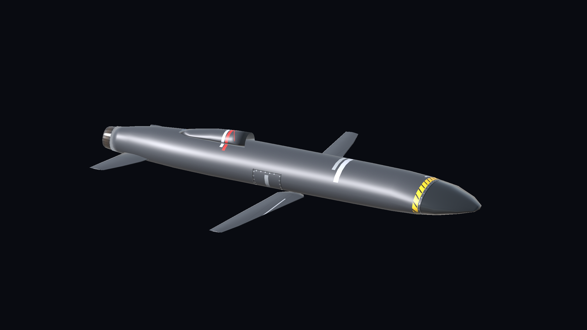

# Phantasm's Arsenal

One DLL containing four editable Blueprinter weapon packs for **Nuclear Option**.

[Download the DLL](https://github.com/XBarni999/Phantasms-Arsenal/raw/refs/heads/main/dist/Phantasms-Arsenal.dll) · [Weapon gallery](docs/GALLERY.md) · [Editing guide](docs/EDITING.md)

| Pack | Weapons |
| --- | --- |
| Poseidon | R-460 aircraft, nuclear and TEL anti-ship variants |
| Killjoy | HSM-290 conventional and nuclear ballistic missiles |
| Apex | Apex drones, airborne variants and cargo pallets |
| Circuit Breaker | Blackout HPM missile, Locust mine dispensers, Lawn Chair and Zhdan smart mines |

## What each weapon does

### R-460 Poseidon — anti-ship cruise missiles

Use the conventional aircraft missile against ships. It is an air-launched cruise missile with a configured maximum launch range of 200 km; practical reach depends on the launch conditions. The nuclear aircraft variant replaces the conventional warhead with a 1.5-kiloton nuclear warhead for concentrated targets. Both aircraft variants share the same exterior.

The TEL variant is launched from a ground vehicle and uses a detachable booster before cruise flight. Its configured engagement range is 108 km. The TEL runtime keeps its automatic target selection focused on ships. The ground launcher and aircraft variants are separate loadout options.

### HSM-290 Killjoy — heavy ballistic strike

Killjoy is a heavy air-launched aeroballistic missile for long-range surface strikes. It accelerates through its motor stages, coasts along a guided lofted trajectory, then dives steeply onto the target. Launch altitude and aircraft speed affect its reach; there is no fixed minimum release altitude. Choose the conventional version for an explosive strike or the nuclear version for a nuclear strike. It requires a compatible heavy-missile station.

### Apex — expendable attack drones

Apex-6 is a low-altitude jet attack drone with a 38 kg shaped-charge/HE warhead. Apex-8 is the faster air-launched variant with a 68 kg shaped-charge/HE warhead. Select a surface target before launch; these are expendable attack weapons rather than reusable aircraft under player control.

Cargo pallets carry eight Apex-6 or four Apex-8 drones. After a ramp drop, they wait seven seconds for separation, then launch their drones at 0.8-second intervals. Pallets require the corresponding compatible cargo mount; aircraft rails and the TEL use their own mounting operations.

### AGM-180 Blackout — temporarily suppress air defenses

Blackout carries a high-power microwave emitter. Select an **enemy ground radar or SAM** before firing: targetless launches and ordinary tank targets are rejected. The missile remembers its original target even if you change selection after launch.

At the default settings, emission starts within 10 km of that target and lasts 20 seconds, affecting exposed receivers within 10 km of the moving missile. Terrain blocks exposure. It suppresses enemy ground electronics, radar, laser defenses and missile-defense targeting. It is intended to open a temporary attack window, rather than destroy a site with a large explosion; its impact charge is only 2 kg HE.

**Friendly aircraft are affected too.** Aircraft of every faction in the emission zone lose radar contacts and remote datalink access. Local optical observations remain available. Electronics recover four seconds after their last exposure. Radar-guided launches can be restricted during the outage; optical, infrared, laser, inertial and unguided weapons retain their native launch behavior. After emission ends, Blackout attacks its remembered surviving target.

### CBU-82M Locust — contact minefield

Locust is an unguided 400 kg dispenser delivered using CCIP. It deploys conventional 7 kg contact mines onto the ground to threaten vehicles crossing the mined area. Mines last 210 seconds after touchdown by default. Use it to cover roads or vehicle routes. The mines are submunitions; select the dispenser in the aircraft loadout.

### CBU-82S Lawn Chair / Zhdan — sensor ambush

Lawn Chair uses a similar dispenser body but carries eight Zhdan sensor mines. Unlike Locust contact mines, Zhdan waits for an enemy ground vehicle within 70 m and requires clear line of sight. It arms four seconds after landing; terrain, bridges and obstacles can prevent detection or attack.

When a target is available, the mine checks its attack corridor, reserves the target, hops upward and hands off to a vanilla GS25 at an 80 m apex. Each mine gets one shot, and nearby mines coordinate target reservations. Unused mines expire after 300 seconds. Choose Lawn Chair to set a vehicle ambush, and Locust to lay a contact minefield. Zhdan is not a separate aircraft loadout item. Its hop, handoff and multiplayer behavior still require further mission testing.

## Installation

Requires BepInEx and Blueprinter **2.0.1 or newer**. Install `dist/Phantasms-Arsenal.dll` in `BepInEx/plugins/PhantasmsArsenal/`.

Before installing, move the separate Poseidon, Killjoy, Apex and Circuit Breaker DLLs and `.nobp` files outside `BepInEx/plugins`. The Arsenal replaces them and uses their existing weapon identities and configuration IDs. Loading both copies can duplicate weapons or patches. Third-party aircraft packs remain separate dependencies for their optional carrier integrations.

## Gallery

All images are rendered from the editable weapon prefabs in Unity. See [the gallery](docs/GALLERY.md).

## Editing and building

The editable pack lives at `Assets/Blueprinter/Mods/PhantasmsArsenal` in the Blueprinter project. See [the editing guide](docs/EDITING.md) for folders and weapon locations. The repository's `UnityAssets/PhantasmsArsenal` contains the same editable assets, with unique Unity GUIDs.

Build the edited `PhantasmsArsenal` folder with Blueprinter's standard Mod Builder, using display name `Phantasm's Arsenal` and version `1.0.0`. Place the resulting `.nobp` in `Bundles`, then compile with `dotnet build Runtime/Arsenal.csproj -c Release`. Game and Blueprinter reference paths can be set with `-p:GameDir` and `-p:BlueprinterProject`. The output is `Runtime/bin/Release/net472/Phantasms-Arsenal.dll`; it embeds the bundle.

The DLL preserves each pack's runtime plugin and configuration identity. A single embedded Blueprinter bundle contains the combined assets and operations.

## Validation

Release compilation and source/embedded bundle SHA-256 checks passed when the package was prepared. A combined loadout/launch test is still required.
